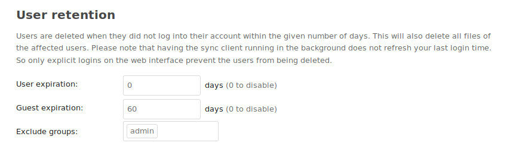

# 👤🗑 User retention

Users are deleted when they did not log into their account within the given number of days. This will also delete all files and other data of the affected users.

* 🛂 Different retention possible for normal users and users of the [guests app](https://apps.nextcloud.com/apps/guests)
* ⛔ Exclude users based on group memberships (default: admin group)
* 🔑 Exclude users that never logged in (default: enabled)

## Users who never logged in

By default users who have never logged in at all will be spared from removal. To also take them into consideration, set the config flag accordingly:

`occ config:app:set user_retention keep_users_without_login --value=no`

In this case the number of days will start counting from the day on which the user has been seen for the first time by the app (first run of the background job after the user was created).

### Example

Retention set to 30 days:

User created | User logged in | `keep_users_without_login` | Cleaned up after
---|---|---|---
7th June | 14th June | yes/default | 14th July
7th June | 14th June | no | 14th July
7th June | - | yes/default | -
7th June | - | no | 7th July
